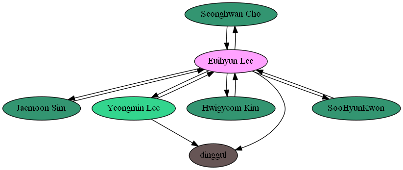

- An image showing your web of trust. You can use
  [sig2dot](http://www.chaosreigns.com/code/sig2dot/) for this purpose.

  

- A digitally signed copy of the [Ethical Conduct Agreement
  form](https://github.com/KAIST-IS521/Agreement). Use your PGP key and copy
  both the agreement form and the signature file to your own repository. You
  should follow the instruction there, i.e., you need to modify the agreement
  accordingly.
